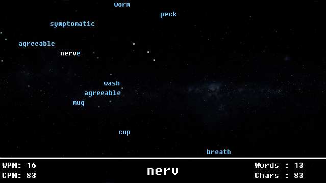

# Wordstream
Wordstream is a tiny (~800 lines of code) typing game that I wrote in July 2020. 
It is heavily inspired by [Bisqwit's WSpeed game](https://bisqwit.iki.fi/wspeed/).
It uses `SDL2` for rendering, `SDL2_ttf` for fonts and `SDL2_mixer` for simple audio playback.  

If you only want to play the game and you happen to run Windows, you can download the binary package in [releases](../../releases).  

## Compiling

The compilation is trivial as well, you need a compiler that supports C99 on any of the platfroms supported by SDL2.  

The dependencies are just [SDL2](https://www.libsdl.org/), [SDL2_ttf](https://www.libsdl.org/projects/SDL_ttf/) and [SDL2_mixer](https://www.libsdl.org/projects/SDL_mixer/)  

If you can use `make`, all it takes is to set the `SDL_CONFIG` environment variable to the full path of the `sdl2-config` file
(if the variable is not defined, `/usr/local/bin/sdl2-config` is used) and running `make`.
This should work on all Unix-like systems and MinGW on Windows (preferably on `msys2`). Otherwise you need to compile manually,
which shouldn't be difficult either.

## Source code and licensing
The whole source code with all its resources is in the public domain (for clarification, read [the unlicense](LICENSE)).  
The source code is available at https://github.com/jacobsebek/wordstream.
